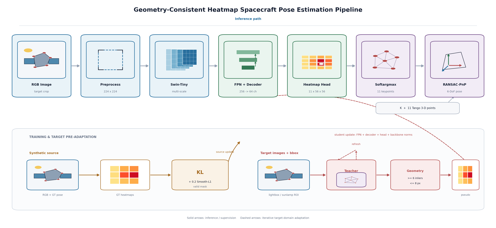
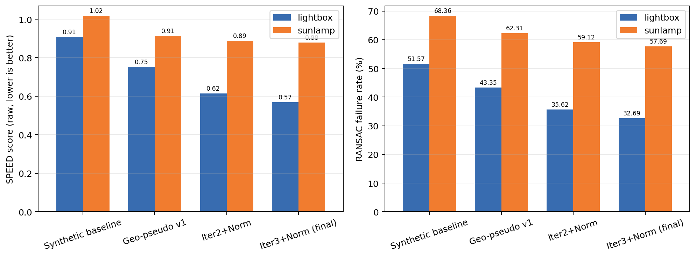
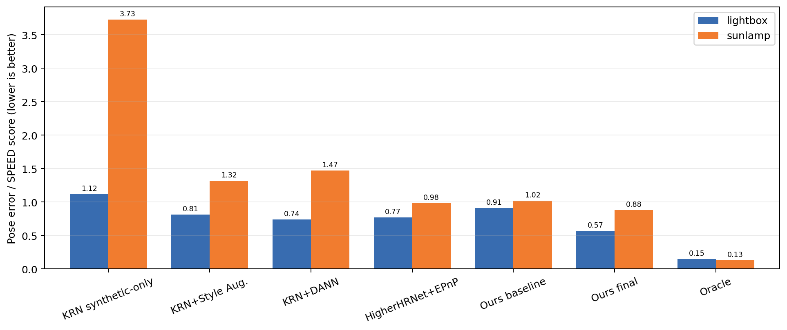
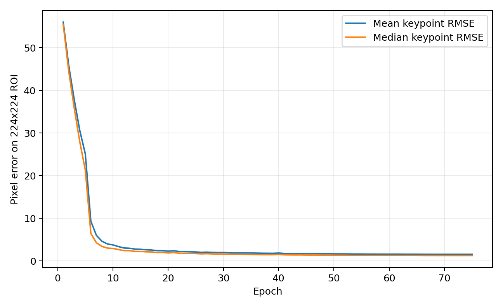

# Geometry-Filtered Pre-Adaptation for Spacecraft Pose Estimation

This repository extends the official SPEED+ baseline with a heatmap-based
spacecraft pose estimator and a lightweight target-domain pre-adaptation
method for the `lightbox` and `sunlamp` hardware-in-the-loop (HIL) domains.

The research question is simple: **can geometric consistency turn uncertain
target-domain keypoints into useful pseudo-labels without using target pose or
keypoint labels as training supervision?**

The resulting pipeline combines:

- a Swin-Tiny feature pyramid network (FPN);
- 11-channel keypoint heatmaps with soft-argmax decoding;
- geometry-aware PnP/RANSAC validation;
- iterative teacher-student pseudo-label refresh; and
- parameter-efficient adaptation of the heatmap head, FPN, and backbone
  normalization parameters.



## Main Results

Lower is better for SPEED score, keypoint RMSE, and RANSAC failure rate.

| Domain | Method | SPEED score | Keypoint RMSE (px) | RANSAC fail (%) | SPEED improvement |
| --- | --- | ---: | ---: | ---: | ---: |
| Lightbox | Synthetic baseline | 0.9076 | 39.61 | 51.57 | - |
| Lightbox | Geometry-filtered pre-adaptation | **0.5696** | **24.74** | **32.69** | **37.23%** |
| Sunlamp | Synthetic baseline | 1.0180 | 46.72 | 68.36 | - |
| Sunlamp | Geometry-filtered pre-adaptation | **0.8794** | **38.67** | **57.69** | **13.61%** |

The final method reduces RANSAC failures by 18.89 percentage points on
Lightbox and 10.68 percentage points on Sunlamp.



The complete result tables are versioned in
[`research/results`](research/results). Published SPEED+ values are included
as a contextual horizontal comparison, not as a strict apples-to-apples
ranking because model implementations and evaluation details differ.



## Research Logic

1. **Build a strong synthetic-domain estimator.** A Swin-Tiny backbone and FPN
   predict spatially meaningful heatmaps instead of directly regressing
   normalized coordinates.
2. **Audit the geometry.** Predicted keypoints are passed through EPnP and
   RANSAC, with explicit checks for reprojection error, inlier count, and
   physically plausible translation.
3. **Construct reliable target pseudo-labels.** Accepted target poses
   reproject the known 3D spacecraft keypoints to produce geometry-consistent
   2D pseudo-labels.
4. **Adapt a small parameter subset.** Only the FPN, heatmap decoder/head, and
   optional backbone normalization parameters are updated.
5. **Refresh and evaluate.** The student becomes the next teacher, then the
   final checkpoint is evaluated on the complete HIL domains.

The current protocol is **bbox-conditioned and pose/keypoint-label-free during
adaptation**: SPEED+ target bounding boxes are used for cropping, while target
pose and keypoint labels are not used in the adaptation loss. Benchmark
annotations are used to prepare ROI records and to perform final evaluation.

See [`docs/research_method.md`](docs/research_method.md) for the method,
ablation interpretation, reproducibility details, and limitations.

An additional multi-round pre-adaptation path inspired by
[`JotaBravo/spacecraft-uda`](https://github.com/JotaBravo/spacecraft-uda)
is available in
[`research/scripts/spacecraft_uda_preadapt.py`](research/scripts/spacecraft_uda_preadapt.py).
It combines iterative target pseudo-label self-training with cross-view
teacher consensus, RANSAC-PnP geometry filtering, and synthetic source replay.
See [`docs/spacecraft_uda_preadapt.md`](docs/spacecraft_uda_preadapt.md).

## Repository Map

```text
src/nets/heatmap_pose.py          Heatmap keypoint network
src/utils/heatmap_pipeline.py     Heatmap targets, decoding, and PnP/RANSAC
src/core/trainer.py               Synthetic-domain training
src/core/inference.py             Pose and keypoint evaluation
scripts/                          Synthetic training and ablation launchers
research/scripts/                 Target pre-adaptation and result utilities
research/results/                 Curated experiment tables and metadata
research/figures/                 Paper-ready architecture and result figures
docs/research_method.md           Research and reproducibility documentation
```

## Environment

Python 3.10 or 3.11 is recommended. Install a CUDA-compatible PyTorch and
Torchvision build first, then install the remaining packages.

```powershell
python -m venv .venv
.\.venv\Scripts\Activate.ps1
python -m pip install --upgrade pip
# Install the PyTorch build appropriate for the local CUDA runtime first.
python -m pip install -r requirements.txt
```

Place the SPEED+ dataset outside the repository. Its root should contain
`camera.json` and the `synthetic`, `lightbox`, and `sunlamp` folders. Model
checkpoints and datasets are intentionally excluded from version control.

## Reproduce the Pipeline

Generate KRN CSV files from SPEED+ annotations when needed:

```powershell
python preprocess.py --projroot . --dataroot <SPEED_PLUS_ROOT> `
  --model_name krn --domain synthetic --jsonfile train.json `
  --csvfile splits_krn/train.csv
```

Run the full synthetic training configuration:

```powershell
.\scripts\run_fulltrain_224_56_E_full.ps1 -MaxEpochs 75 -BatchSize 48 -RunTag paper
```

Prepare bbox-conditioned HIL CSV files:

```powershell
python research\scripts\prepare_target_dataset.py `
  --dataroot <SPEED_PLUS_ROOT> --outroot work\target_dataset
```

Run the final two-stage target pre-adaptation schedule:

```powershell
.\research\scripts\run_target_preadapt.ps1 `
  -DataRoot work\target_dataset `
  -BaseCheckpoint checkpoints\fulltrain_224_56_E_full_paper\model_best.pth.tar `
  -Domain lightbox
```

Evaluate a baseline or adapted checkpoint:

```powershell
.\research\scripts\evaluate_heatmap_domain.ps1 `
  -DataRoot work\target_dataset `
  -Checkpoint outputs\preadapt\lightbox\stage2\model_adapted.pth.tar `
  -Domain lightbox
```

Repeat the final two commands with `-Domain sunlamp`.

## Synthetic-Domain Reference

The best synthetic validation checkpoint is epoch 72:

| Metric | Value |
| --- | ---: |
| Mean / median keypoint RMSE | 1.556 / 1.256 px |
| Median translation error | 0.0184 m |
| Median rotation error | 0.6519 deg |
| Thresholded SPEED score | 0.0203 |
| RANSAC failure rate | 1.067% |



## Data Generation Modules

The broader research workflow also contains two independent modules for
building render-to-real translation data from manually captured spacecraft
images. Their paper-ready process diagrams are included for documentation.

| Module | Figure |
| --- | --- |
| SAM2 semantic segmentation and dataset construction | [`sam2_satellite_dataset_generation_flowchart.png`](research/figures/sam2_satellite_dataset_generation_flowchart.png) |
| img2img-turbo render-to-real style transfer | [`img2img_turbo_satellite_render2real_flowchart.png`](research/figures/img2img_turbo_satellite_render2real_flowchart.png) |

## Attribution

This work is built on the official implementation accompanying:

> T. H. Park et al., "SPEED+: Next-Generation Dataset for Spacecraft Pose
> Estimation across Domain Gap," 2022 IEEE Aerospace Conference.

Please cite the SPEED+ paper and its official baseline when using this code.
The original MIT license is retained in [`LICENSE.md`](LICENSE.md).
