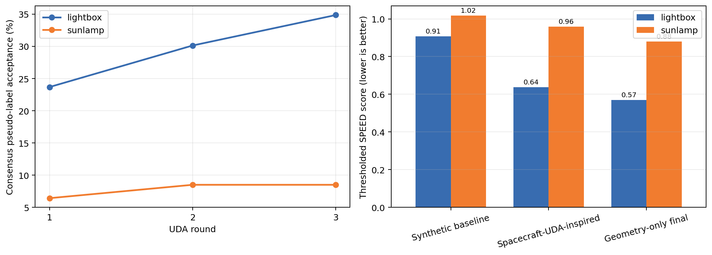

# Spacecraft-UDA-Inspired Pre-Adaptation

This implementation adapts the multi-iteration pseudo-label self-training
workflow from [JotaBravo/spacecraft-uda](https://github.com/JotaBravo/spacecraft-uda)
to the Swin-Tiny-FPN heatmap keypoint estimator in this repository.

The upstream project repeatedly generates pseudo-labels on target images,
trains a new model using those pseudo-labels, and refreshes the model for the
next iteration. Directly copying its Hourglass/BPnP model is not compatible
with this repository, so the same research logic is implemented using the
existing heatmap and RANSAC-PnP pipeline.

## Adapted Method

For every target image, a frozen teacher predicts keypoints on:

1. the deterministic target ROI; and
2. a photometrically perturbed view of the same ROI.

Both predictions must independently pass RANSAC-PnP geometry validation.
Their poses must then satisfy cross-view consensus thresholds for rotation,
relative translation, and mean keypoint disagreement. The two accepted poses
are fused and the known 3D Tango keypoints are reprojected to form a rigid,
geometry-consistent pseudo-label.

The student updates only the FPN, decoder/head, and optional backbone
normalization parameters. Synthetic source replay is mixed into target
training to reduce catastrophic forgetting. After each round, the student is
used as the teacher for the next pseudo-label generation round.

## Default Filters

| Filter | Default |
| --- | ---: |
| Minimum RANSAC inliers per view | 6 |
| Median inlier reprojection error | <= 8 px |
| Translation norm | 0.5 to 20.0 m |
| Cross-view pose angle | <= 15 deg |
| Cross-view relative translation | <= 0.20 |
| Cross-view mean keypoint disagreement | <= 15 px |

## Run

Prepare target-domain CSV files:

```powershell
python research\scripts\prepare_target_dataset.py `
  --dataroot D:\进阶项目\CNN\speedplusv2 `
  --outroot work\target_dataset
```

Run three adaptation rounds:

```powershell
.\research\scripts\run_spacecraft_uda_preadapt.ps1 `
  -TargetDataRoot work\target_dataset `
  -SourceDataRoot D:\进阶项目\CNN\speedplusv2 `
  -Checkpoint checkpoints\fulltrain_224_56_E_full\checkpoint.pth.tar `
  -Domain lightbox `
  -PythonExe C:\path\to\python.exe
```

Repeat with `-Domain sunlamp`.

`-PythonExe` is optional when the repository `.venv`, `SPEEDPLUS_PYTHON`
environment variable, or system `python` already provides PyTorch, timm, and
OpenCV.

Every round writes:

- `pseudo_labels.json` and `pseudo_labels.csv`;
- pseudo-label acceptance statistics;
- the adapted round checkpoint; and
- loss and parameter-update statistics.

The final model is saved as `model_final.pth.tar`.

## Full-Domain Results

The three-round experiment improves on the synthetic-only checkpoint in both
HIL domains. It remains below the repository's geometry-only final model and
is therefore retained as a UDA comparison/ablation rather than the recommended
production checkpoint.

| Domain | Method | SPEED | Mean KP RMSE | RANSAC fail |
| --- | --- | ---: | ---: | ---: |
| Lightbox | Synthetic baseline | 0.9076 | 39.61 px | 51.57% |
| Lightbox | Spacecraft-UDA-inspired | **0.6368** | **27.84 px** | **37.49%** |
| Lightbox | Geometry-only final | 0.5696 | 24.74 px | 32.69% |
| Sunlamp | Synthetic baseline | 1.0180 | 46.72 px | 68.36% |
| Sunlamp | Spacecraft-UDA-inspired | **0.9596** | **44.29 px** | **65.07%** |
| Sunlamp | Geometry-only final | 0.8794 | 38.67 px | 57.69% |

Lightbox consensus pseudo-label acceptance increases from 23.68% to 34.87%
across three rounds. Sunlamp increases from 6.41% to 8.49%, confirming that
its severe illumination domain remains substantially harder.



## Relationship to the Upstream Project

The retained upstream ideas are iterative pseudo-label generation, robust
pseudo-label filtering, and repeated target-domain retraining. The local
extension adds cross-view consensus, RANSAC-PnP rigid-geometry checks, and
source replay because these mechanisms are directly compatible with the
existing keypoint model and SPEED+ evaluation protocol.
